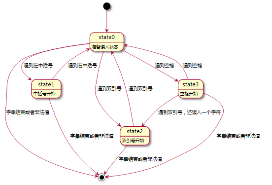
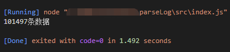

# 利用状态机解析访问日志

有限状态机 (FSM：Finite State Machine)，简称状态机，是表示有限多个状态以及在这些状态之间转移和动作的数学模型。

状态机的要素:

状态机可归纳为4个要素，即现态、条件、动作、次态。“现态”和“条件”是因，“动作”和“次态”是果。详解如下：

现态：是指当前所处的状态。

条件：又称为“事件”。当一个条件被满足，将会触发一个动作，或者执行一次状态的迁移。

动作：条件满足后执行的动作。动作执行完毕后，可以迁移到新的状态，也可以仍旧保持原状态。动作不是必需的，当条件满足后，也可以不执行任何动作，直接迁移到新状态。

次态：条件满足后要迁往的新状态。“次态”是相对于“现态”而言的，“次态”一旦被激活，就转变成新的“现态”了。

访问日志解析： 给以行访问日志解析出对应字段，日志字段按顺序依次为：


+ level，time，sName用中括号
+ statusCode，processTimes，responseSize为数字
+ 其他字段为字符串，如果字串不包含空格，可以不加引号，也可以加引号,
+ 未知数字值用0， 未知字符值用-


如：

```
[INFO ][2021-11-28 16:08:07][info-api-center]72782 970bb699-368a-5260-a489-aad069942be8 0 "HTTP/1.1" "GET" info_api_center_v1 "/info-api-center/center-apis" "Mozilla/5.0 (Macintosh; Intel Mac OS X 10_14_6) AppleWebKit/537.36 (KHTML, like Gecko) Chrome/92.0.4515.159 Safari/537.36" 200 19 941 202.10.23.14
```

解析为：

```
{
  "level": "INFO",
  "time": "2021-11-28 16:08:07",
  "sName": "info-api-center",
  "userId": "72782",
  "tid": "970bb699-368a-5260-a489-aad069942be8",
  "rpcid": "0",
  "protocol": "HTTP/1.1",
  "method": "GET",
  "host": "info_api_center_v1",
  "url": "/info-api-center/center-apis",
  "ua": "Mozilla/5.0 (Macintosh; Intel Mac OS X 10_14_6) AppleWebKit/537.36 (KHTML, like Gecko) Chrome/92.0.4515.159 Safari/537.36",
  "statusCode": "200",
  "processTimes": "19",
  "responseSize": "941",
  "ip": "202.10.23.14"
}
```

先得到字段列表，字段有中括号包起，也有引号包起，也有空格分割，还存在没有任何起始字符。

将读入字符的状态分为一下几种：


+ state0: 准备读入状态
+ state1: 中括号开始
+ state2: 双引号开始
+ state3: 空格开始




根据以上状态图编码如下：

filebeat使用go编写，内部并非使用V8,支持的es5

数字0~3分别代表一下几种状态，-1表示结束

```
state0: 准备读入状态
state1: 中括号开始
state2: 双引号开始
state3: 空格开始
```

### 测试结果

10万条数据跑完消耗 1.492秒



